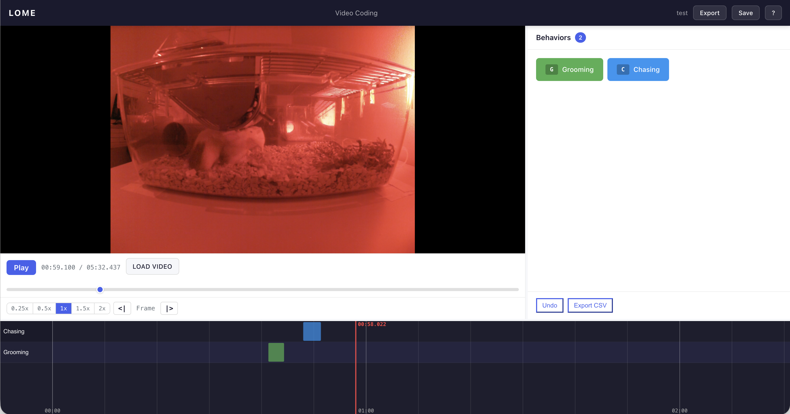

# EthoLogger

**Video Annotation & Behavioral Coding**

Build an ethogram. Code animal behavior from video. Export your data.

EthoLogger is a free, browser-based tool for scoring animal behavior from video. It runs entirely in the browser — no installation, no server, and no data ever leaves your machine.

**[Open EthoLogger](https://javarhol.github.io/EthoLogger/)**



## Getting Started

1. Go to **[javarhol.github.io/EthoLogger](https://javarhol.github.io/EthoLogger/)**
2. Click **New Project** and enter a project name + your coder ID
3. Build your ethogram (define behaviors) or click **Load Sample Ethogram** for a pre-made mouse behavior set
4. Click **Next: Code Video** and load an MP4 video file
5. Press keyboard shortcuts to code behaviors as the video plays
6. Click **Export CSV** when finished

> You can also clone this repository and open `index.html` directly in Chrome.

## Features

### Project Management
- Create, save, and resume multiple projects
- Export/import projects as JSON for backup or sharing between machines
- Auto-saves your work to the browser's local storage

### Ethogram Builder
- Define behaviors with a name, category, type (point or state), keyboard shortcut, and color
- **Point events** mark a single moment in time (e.g., a jump)
- **State events** have a duration — press the key to start, press again to stop (e.g., grooming)
- Real-time keyboard shortcut validation with feedback
- Auto-assigned colors from a 12-color palette
- Save/load ethograms as JSON files to share with other coders
- Includes a sample mouse home cage ethogram with 8 common behaviors

### Video Coding
- Load any MP4 video file from your computer (the file stays on your machine — nothing is uploaded)
- Or **load from a direct video URL** (`.mp4`, `.webm`, public CDN links) — useful for shared research clips. URL-loaded videos auto-restore when you reopen the project. *Note:* YouTube watch URLs (`youtube.com/watch?v=...`) are not supported — use a direct video link.
  - As a workaround for YouTube content you have rights to, [`yt-dlp`](https://github.com/yt-dlp/yt-dlp) can extract a direct stream URL: `yt-dlp -g <youtube-url>`. Paste the result into Load URL. Heads up — these URLs are signed and expire in a few hours, so they won't auto-restore reliably across sessions. For durable workflows, prefer hosting the MP4 yourself (lab server, S3, Cloudflare R2, etc.).
- Playback speed controls: 0.25x, 0.5x, 1x, 1.5x, 2x
- Frame-accurate stepping with `,` and `.` keys
- Keyboard-driven coding for speed, or click the behavior buttons
- Active state events glow to show they're recording
- Undo with Ctrl+Z (Cmd+Z on Mac)

### Scan Coding
For scan-sampling long recordings: configure an **interval** (e.g. 60s) and a **sample duration** (e.g. 5s), and EthoLogger will jump the playhead through the video, playing each sample window in turn. Useful for estimating behavior frequencies without watching every second.

- **Auto-advance** mode loops continuously through the video
- **Pause-between** mode stops after each sample so you can finish coding; press Space (or Continue) to advance to the next window
- Each played window is recorded on the project and shown as a translucent blue band along the top of the timeline, so you can audit which intervals were actually reviewed (helpful for IRR)

### Timeline
- Color-coded bars show all coded behaviors over time
- Click anywhere on the timeline to seek the video
- Scroll to zoom in/out
- Scan-sampled windows appear as a blue band along the top

### CSV Export
Exports a standard CSV file with these columns:

| Column | Description |
|--------|-------------|
| onset_sec | Start time in seconds |
| offset_sec | End time in seconds (blank for point events) |
| duration_sec | Duration in seconds |
| onset_time | Start time as MM:SS.mmm |
| offset_time | End time as MM:SS.mmm |
| behavior | Behavior name |
| category | Behavior category |
| type | "point" or "state" |
| coder_id | Your coder ID |
| video_file | Video filename |

## Keyboard Shortcuts

| Key | Action |
|-----|--------|
| Space | Play / Pause (or Continue to next sample in scan-mode pause-between) |
| , | Step back one frame |
| . | Step forward one frame |
| Left arrow | Seek back 5 seconds |
| Right arrow | Seek forward 5 seconds |
| Ctrl+Z | Undo last action |
| ? | Show help overlay |
| Escape | Close help overlay |
| a-z, 0-9 | Code behavior (as defined in your ethogram) |

## Sample Ethogram (Mouse Home Cage)

| Key | Behavior | Category | Type |
|-----|----------|----------|------|
| L | Locomotion | Locomotion | State |
| R | Rearing | Exploration | State |
| G | Grooming | Maintenance | State |
| F | Feeding | Feeding | State |
| D | Digging | Exploration | State |
| E | Resting | Resting | State |
| Z | Freezing | Anxiety | State |
| J | Jump | Locomotion | Point |

## Privacy & Data

EthoLogger runs entirely in your browser. No data is uploaded to any server. Video files are never transmitted — they stay on your machine. All project data is stored in your browser's localStorage.

## Tips for Coders

- **Code one behavior at a time.** Watch the full video coding only locomotion, then watch again for grooming, etc. This is faster and more accurate than coding everything at once.
- **Use keyboard shortcuts** rather than clicking buttons — it lets you keep your eyes on the video.
- **Save your ethogram as JSON** and share it with all coders on your project so everyone uses the same coding scheme.
- **Export frequently.** While auto-save protects against accidental tab closure, exporting a CSV or project JSON gives you a permanent backup.
- **Use project JSON export/import** to back up your work or transfer projects between machines and team members.

## Browser Support

- **Recommended:** Google Chrome (latest)
- Works in Firefox, Safari, and Edge
- Video format support depends on your browser — MP4 (H.264) works everywhere
- On iPad: works best with a physical keyboard; for full functionality, use the hosted version at the link above rather than opening from the Files app

## For Developers

- Pure HTML/CSS/JavaScript — no build tools, no server, no dependencies to install
- Two vendored libraries: [Papa Parse](https://www.papaparse.com/) (CSV) and [VideoFrame.js](https://github.com/allensarkisyan/VideoFrame) (frame stepping)
- All data stored in the browser's localStorage
- Works from the `file://` protocol (just double-click `index.html`)

```
ethologger/
  index.html              Entry point
  css/style.css           Stylesheet
  js/
    utils.js              Helper functions
    store.js              localStorage persistence
    ethogram.js           Ethogram builder
    coder.js              Video coding engine
    scan-mode.js          Scan-sampling state machine
    timeline.js           Canvas timeline
    exporter.js           CSV export
    app.js                App orchestrator
  vendor/
    papaparse.min.js      CSV library
    VideoFrame.min.js     Frame-accurate seeking
  sample/
    sample-ethogram.json  Mouse behavior ethogram
```

## License

MIT
